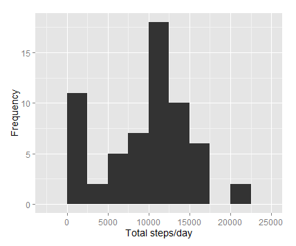

##Introduction

It is now possible to collect a large amount of data about personal movement using activity monitoring devices such as a Fitbit, Nike Fuelband, or Jawbone Up. These type of devices are part of the "quantified self" movement - a group of enthusiasts who take measurements about themselves regularly to improve their health, to find patterns in their behavior, or because they are tech geeks. But these data remain under-utilized both because the raw data are hard to obtain and there is a lack of statistical methods and software for processing and interpreting the data.

This assignment makes use of data from a personal activity monitoring device. This device collects data at 5 minute intervals through out the day. The data consists of two months of data from an anonymous individual collected during the months of October and November, 2012 and include the number of steps taken in 5 minute intervals each day.

##Loading and Preprocessing the Data

First, read the date coercing the date column to character rather than factor

```{r echo=TRUE}
xtvtData <- read.csv("activity.csv", header = T, sep = ",", stringsAsFactors = F)
```

Convert the date column to the appropriate format:

```{r echo=TRUE}
xtvtData$date <- as.Date(xtvtData$date, "%Y-%m-%d")
str(xtvtData)
```

##What is Mean Total Number of Steps Taken per Day?

Group and summarize the data and store it in the variable avgDay

```{r echo=TRUE}
library(dplyr)
avgDay <- xtvtData %>% group_by(date) %>%
  summarize(total.steps = sum(steps, na.rm = T), 
            mean.steps = mean(steps, na.rm = T))
```

Construct the histogram

```{r echo=TRUE}
library(ggplot2)
g <- ggplot(avgDay, aes(x = total.steps))
g + geom_histogram(binwidth = 2500) + theme(axis.text = element_text(size = 12),  
                                            axis.title = element_text(size = 14)) + labs(y = "Frequency") + labs(x = "Total steps/day")

 

summary(avgDay$total.steps)

summary (avgDay$mean.steps)
```

##What is the Daily Activity Pattern?

Group the data by intervaland then calculate the mean of each interval group:

```{r echo=TRUE}
avgInterval <- xtvtData %>% group_by(interval) %>%
  summarize(mean.steps = mean(steps, na.rm = T))

g <- ggplot(avgInterval, aes(x = interval, y = mean.steps))

g + geom_line() + theme(axis.text = element_text(size = 12), 
                        axis.title = element_text(size = 14, face = "bold")) + 
  labs(y = "Mean Number of Steps") + labs(x = "Interval")
```

##Imputing Missing Values

```{r echo=TRUE}
mean(is.na(xtvtData$steps))

sum(is.na(xtvtData$steps))

sum(is.na(avgInterval$mean.steps))

xtvtData2 <- xtvtData

for (i in 1:nrow(xtvtData2)) {
  if (is.na(xtvtData2$steps[i])) {
    index <- xtvtData2$interval[i]
    value <- subset(avgInterval, interval==index)
    xtvtData2$steps[i] <- value$mean.steps
  }
}
head(xtvtData2)

newAvg <- xtvtData2 %>% group_by(date) %>%
  summarize(total.steps = sum(steps, na.rm = T))
```

Construct the histogram

```{r echo=TRUE}
g <- ggplot(newAvg, aes(x=total.steps))
g + geom_histogram(binwidth = 2500) + theme(axis.text = element_text(size = 12),
                                            axis.title = element_text(size = 14)) + labs(y = "Frequency") + labs(x = "Total steps/day")

summary (avgDay$total.steps)

sd(avgDay$total.steps, na.rm = T)

summary (newAvg$total.steps)

sd(newAvg$total.steps, na.rm = T)
```

##Are There Differences in Activity Patterns Between Weekdays and Weekends?

```{r echo=TRUE}
daytype <- function(date) {
        if (weekdays(as.Date(date)) %in% c("Saturday", "Sunday")) {
                "Weekend"
        } else {
                "Weekday"
        }
}
xtvtData2$date <- as.Date(xtvtData2$date)
xtvtData2$day <- sapply(xtvtData2$date, FUN = daytype)

averages <- aggregate(steps ~ interval + day, data = xtvtData2, mean)
ggplot(averages, aes(interval, steps)) + geom_line() + facet_grid(day ~ .) + 
    xlab("Interval") + ylab("Number of Steps")
```
